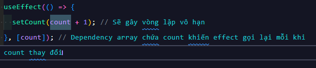
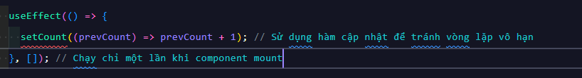

## ------------- Project mini 01 [hiển thị thời gian thực] bằng useState-useEffect -------------

# Kiến thức vận dụng:

-> hook[useEffect,useState]
-> setTimeout(),setInterval(),clearInterval,clearTimeout
-> Object Date(),formattedDate,padEnd,padStart
-> Array: month,day,...

# Sử dụng useState để lưu trữ trạng thái thời gian:

-> Việc dùng useState để lưu trữ ngày giờ hiện tại là phù hợp.
Nó giúp đồng hồ được cập nhật đúng cách mỗi khi trạng thái thay đổi.

# Sử dụng useEffect để xử lý login cập nhật thời gian:

-> useEffect được sử dụng đúng cách để tạo setInterval chạy mỗi giây
và clearInterval để ngăn rò rỉ tài nguyên khi component bị hủy.

# Định dạng ngày giờ:

-> Code định dạng ngày, tháng, và giờ bằng cách sử dụng padStart và mảng là hợp lý, dễ hiểu và trực quan.

# Vấn đề cần cải thiện:

-> Khi sử dụng "setInterval": mỗi lần render lại, có thể hoạt động không như mong muốn nếu không có "clearInterval"
-> Chuyển các mạng khởi tạo "days", và "months" ra khỏi components vì không thay đổi nên components render lại sẻ dẫn tới dư thừa
-> Thay vì dùng padStart cho định dạng giờ, phút, giây, bạn có thể dùng Intl.NumberFormat
-> Cải tiến: sử dụng "setTimeout" thay thế "setInterval" để cập nhật thời gian cùng với "useEffect"

## Vì sao ?

=> Thông thường khi sử dụng "setInterval" có thể xảy ra hiện tưởng "trễ"
do thời gian xử lý trong mỗi "chu kỳ" không được tính vào khoảng cách giữa các lần lặp
=> Với "setTimeout" mỗi lần chạy được tính toán dựa trên thời gian thực tế -> hoạt động đúng hơn
=> "setTimeout" và "useEffect" kết hợp có thể hoạt động tương tự và hơn "setInterval"
bằng cách thiết lập cho nó tự gọi lại chính nó sau mỗi lần hoàn thành
=> setTimeout dễ dàng dọn dẹp và tránh rủi ro rò rỉ bộ nhớ hơn so với setInterval.

## Vật khi nào nên sử dụng setInterval:

=> Nếu bạn cần một tác vụ chạy độc lập theo thời gian cố định,
không liên quan nhiều đến state của React,
ví dụ: gửi tín hiệu ping đến serve

# Kiến thức học được:

## Mục tiêu:

-> Hiểu về vòng đời components trong ReactJS (mount,update,unmount)
-> Xử lý bất đồng bộ trong useEffect() -> project mini 03 (bài sau)
-> Clean up hiệu ứng

## Tìm hiểu chi tiết: (Nguồn Example01)

=> Sử dụng useEffect để mô phỏng vòng đời
useEffect là hook giúp ta thực hiện các tác vụ bên ngoài (e.g., gọi API, đăng ký sự kiện)
và có thể được sử dụng để xử lý các giai đoạn của vòng đời component.

# Dự án nhỏ:

-> Ứng dụng hiển thị thời gian hiện tại (real-time)

# Kiến thức bổ sung:

## Mục tiêu:

-> Tìm hiểu về "dependency" array ảnh hưởng tới useEffect()

# Kiến thức mở rộng:

=> Dependency array xác định khi nào useEffect sẽ được gọi lại.
Nếu dependency array trống ([]), effect chỉ chạy khi component mount lần đầu.
Nếu có dependencies, effect sẽ chạy lại mỗi khi các giá trị trong array thay đổi.

## Mục tiêu:

# Thức hành chồng lặp vô hạn khi sử dụng useEffect()

=> Một vấn đề phổ biến khi sử dụng useEffect là tạo ra vòng lặp vô hạn nếu effect thay đổi state mà lại phụ thuộc vào chính state đó trong dependency array.

=> Cách khắc phục: Để tránh lỗi vòng lặp vô hạn, ta cần tránh thay đổi state trực tiếp trong useEffect nếu state đó đã có trong dependency array. N
ếu cần thay đổi state theo giá trị trước đó, có thể sử dụng hàm cập nhật state

---

## Vòng đời của components trong React (mount,update,unmount)

=> Trong React có 3 giai đoạn chính trong vòng đời của nó:

# Mount: Component được tạo ra và đưa vào DOM (lần đầu tiên khi render)

# Update: Component cập nhật khi "state" hoặc "props" thay đổi

# Unmount: Component bị xóa khỏi DOM (khi component bị hủy bỏ hoặc bị loại bỏ)

### Tóm tắt:

# Mount, Update, Unmount: useEffect giúp xử lý các tác vụ theo từng giai đoạn vòng đời của component, ví dụ như đăng ký sự kiện (mount) và dọn dẹp tài nguyên (unmount).

# Xử lý bất đồng bộ: useEffect kết hợp với async/await giúp bạn dễ dàng xử lý các tác vụ bất đồng bộ như gọi API.

# Cleanup: Dọn dẹp tài nguyên (timer, sự kiện, v.v.) để tránh memory leaks khi component bị unmount.

# Dependency Array: Quản lý khi nào useEffect cần chạy lại. Điều này giúp tối ưu hiệu suất và tránh chạy effect không cần thiết.

# Vòng lặp vô hạn: Cẩn thận khi sử dụng state trong dependency array để tránh tạo ra vòng lặp vô hạn. Sử dụng hàm cập nhật state để tránh việc gọi setState gây re-render liên tục.
