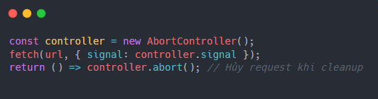
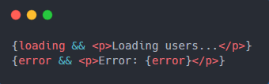
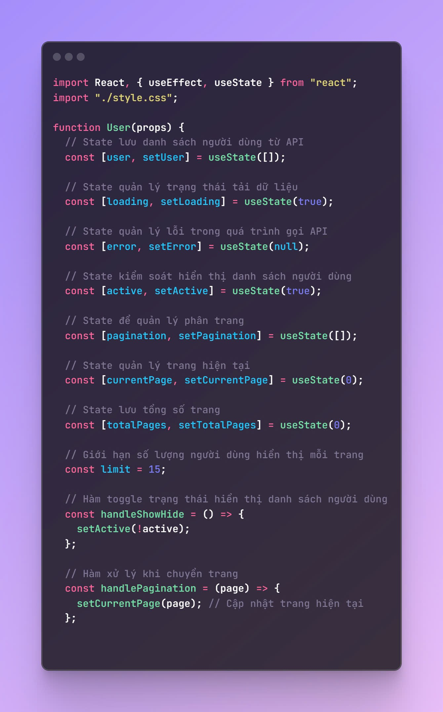
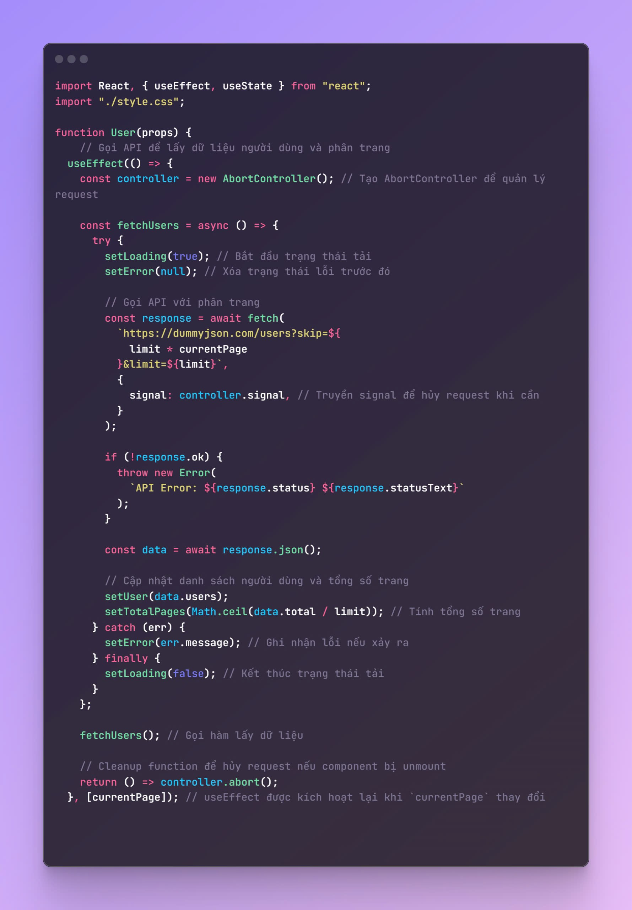
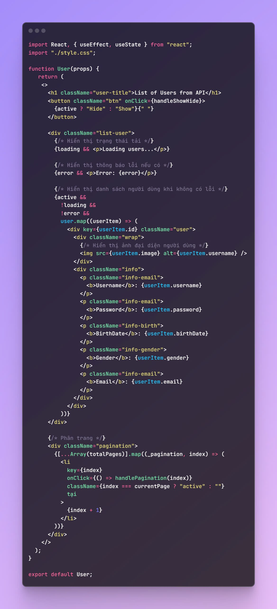
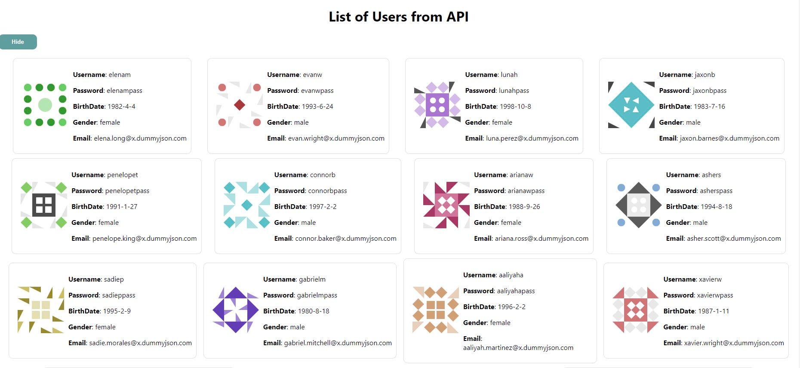

## ------------- Project mini 03 [show list user in API] bằng useState,useEffect -------------

# Kiến thức vận dụng:

1. Sử dụng userState quản lý trạng thái components

- user: Danh sách người dùng lấy từ API.
- loading: Trạng thái tải dữ liệu (loading spinner).
- error: Quản lý lỗi khi gọi API.
- active: Kiểm soát việc hiển thị danh sách người dùng.
- currentPage: Quản lý số trang hiện tại khi phân trang.
- totalPages: Tính toán tổng số trang dựa trên dữ liệu từ API.

2. Sử dụng useEffect

- Sử dụng useEffect để:
- Gọi API khi component render lần đầu.
- Tự động cập nhật dữ liệu mỗi khi giá trị của currentPage thay đổi (phân trang).

3. Fetch API

- Thực hiện yêu cầu HTTP GET từ API:
- URL động: Sử dụng template string để tạo URL phân trang.
- Kiểm tra trạng thái HTTP: Đảm bảo response hợp lệ với response.ok.

4. Điều kiện hiển thị trong React

- Conditional Rendering:
- Hiển thị trạng thái tải (loading), lỗi (error), hoặc dữ liệu dựa trên điều kiện cụ thể.
- Ẩn/hiện danh sách người dùng bằng nút toggle (active).

5. JSX và Mapping Array

- Sử dụng map để lặp qua danh sách người dùng và render từng phần tử.
- Hiển thị dữ liệu động như username, birthDate, email từ API.

6.  Cleanup trong useEffect

- Sử dụng AbortController để hủy các request khi component unmount hoặc khi currentPage thay đổi.

7. Phân trang

- Sử dụng vòng lặp [...Array(totalPages)] để tạo danh sách nút phân trang.
- Gọi API để cập nhật dữ liệu khi người dùng nhấn vào một trang cụ thể.

# Kiến thức mới :

1.  AbortController
    -> Chức năng: Hủy bỏ một yêu cầu fetch nếu nó không còn cần thiết
    -> ví dụ: khi component unmount hoặc có thay đổi liên quan đến API call
    -> Sử dụng: 

2.  Quản lý UI loading/error
    -> Thêm trạng thái loading để hiển thị thông báo trong lúc dữ liệu đang được tải:
    -> Hiển thị lỗi nếu request thất bại
    -> Ví dụ: 

3.  Hiệu quả và tối ưu hóa
    -> Tránh gọi lại API không cần thiết:
    -> Chỉ gọi API khi currentPage thay đổi, nhờ dependency array của useEffect
    -> Tránh memory leak:
    -> Hủy request đang chạy khi component unmount hoặc khi API call không còn cần thiết, nhờ AbortController.

# Tổng kết:

- Kiến thức đã sử dụng:
- React Hooks: useState, useEffect.
- Fetch API: Lấy dữ liệu từ API và xử lý response.
- JSX: Hiển thị dữ liệu với map và điều kiện.
- Phân trang cơ bản: Tính toán và render các nút trang.
- Kiến thức mới áp dụng:
- AbortController: Hủy yêu cầu fetch không cần thiết.
- Loading và Error Handling: Xử lý trạng thái trong khi fetch API.
- Phân trang nâng cao: Tự động cập nhật dữ liệu dựa trên trạng thái trang hiện tại.

## Demo:

1. Code:

- 
- 
- 

2. Giao diện: 
