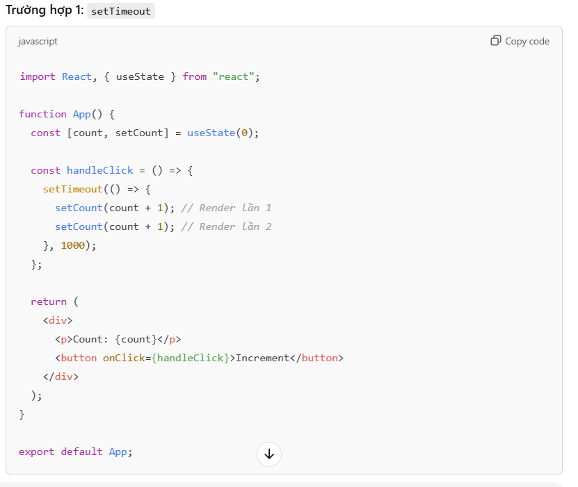
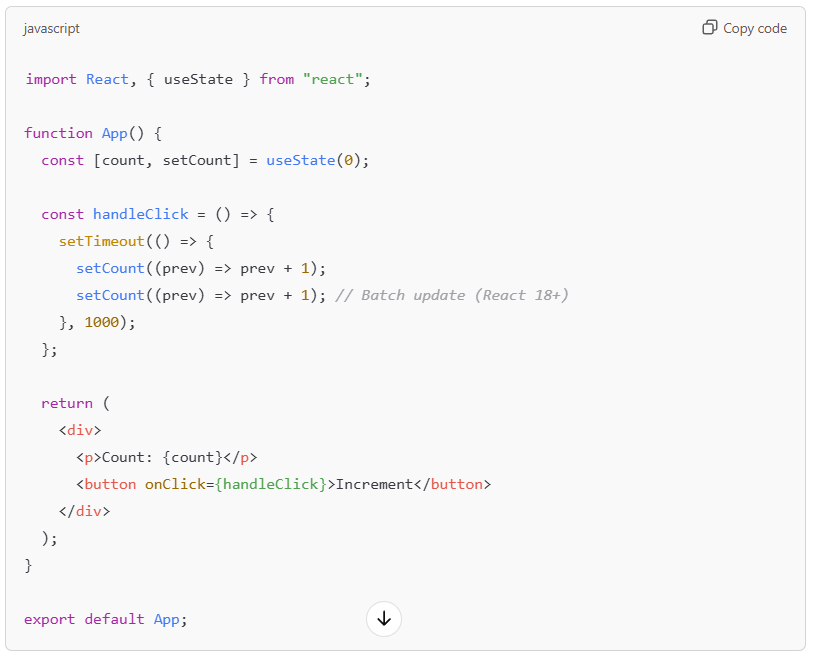
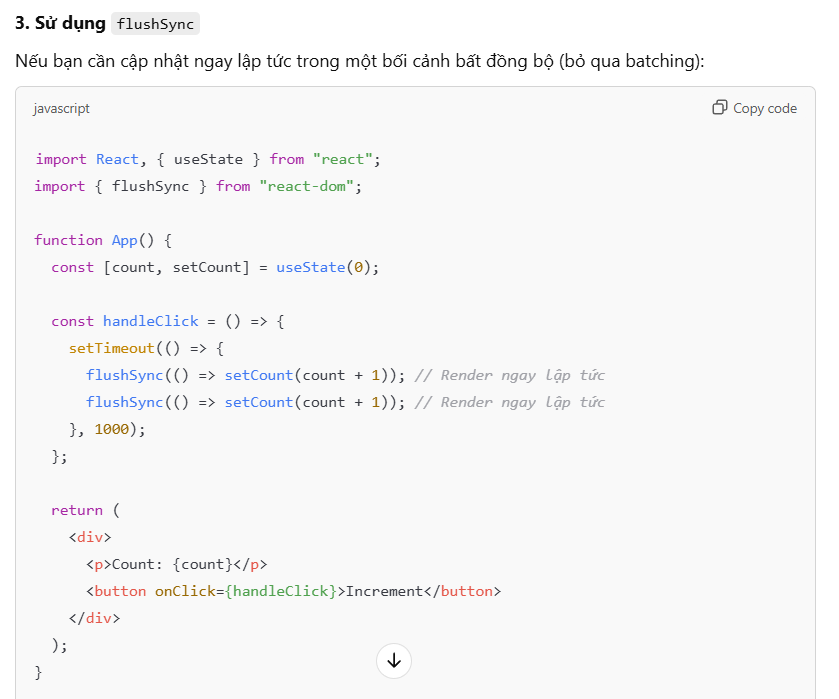
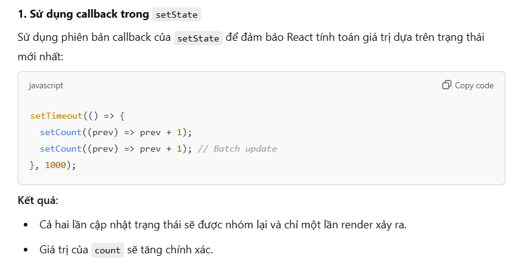

### -------------------------------- ReactJS --------------------------------

-> Author: @Vinhdev04

# Getting Started with Create React App

This project was bootstrapped with [Create React App](https://github.com/facebook/create-react-app).

## Available Scripts

In the project directory, you can run:

### `npm start`

Runs the app in the development mode.\
Open [http://localhost:3000](http://localhost:3000) to view it in your browser.

The page will reload when you make changes.\
You may also see any lint errors in the console.

### `npm test`

Launches the test runner in the interactive watch mode.\
See the section about [running tests](https://facebook.github.io/create-react-app/docs/running-tests) for more information.

### `npm run build`

Builds the app for production to the `build` folder.\
It correctly bundles React in production mode and optimizes the build for the best performance.

The build is minified and the filenames include the hashes.\
Your app is ready to be deployed!

See the section about [deployment](https://facebook.github.io/create-react-app/docs/deployment) for more information.

### `npm run eject`

**Note: this is a one-way operation. Once you `eject`, you can't go back!**

If you aren't satisfied with the build tool and configuration choices, you can `eject` at any time. This command will remove the single build dependency from your project.

Instead, it will copy all the configuration files and the transitive dependencies (webpack, Babel, ESLint, etc) right into your project so you have full control over them. All of the commands except `eject` will still work, but they will point to the copied scripts so you can tweak them. At this point you're on your own.

You don't have to ever use `eject`. The curated feature set is suitable for small and middle deployments, and you shouldn't feel obligated to use this feature. However we understand that this tool wouldn't be useful if you couldn't customize it when you are ready for it.

## Learn More

You can learn more in the [Create React App documentation](https://facebook.github.io/create-react-app/docs/getting-started).

To learn React, check out the [React documentation](https://reactjs.org/).

### Code Splitting

This section has moved here: [https://facebook.github.io/create-react-app/docs/code-splitting](https://facebook.github.io/create-react-app/docs/code-splitting)

### Analyzing the Bundle Size

This section has moved here: [https://facebook.github.io/create-react-app/docs/analyzing-the-bundle-size](https://facebook.github.io/create-react-app/docs/analyzing-the-bundle-size)

### Making a Progressive Web App

This section has moved here: [https://facebook.github.io/create-react-app/docs/making-a-progressive-web-app](https://facebook.github.io/create-react-app/docs/making-a-progressive-web-app)

### Advanced Configuration

This section has moved here: [https://facebook.github.io/create-react-app/docs/advanced-configuration](https://facebook.github.io/create-react-app/docs/advanced-configuration)

### Deployment

This section has moved here: [https://facebook.github.io/create-react-app/docs/deployment](https://facebook.github.io/create-react-app/docs/deployment)

### `npm run build` fails to minify

This section has moved here: [https://facebook.github.io/create-react-app/docs/troubleshooting#npm-run-build-fails-to-minify](https://facebook.github.io/create-react-app/docs/troubleshooting#npm-run-build-fails-to-minify)

### Multiple Page Application ?

-> MPA là kiểu website hoạt theo cách truyền thống khi người dùng yêu cầu mộ trang web thì server sẻ tính toán trả về trang wed cho người dùng dưới dạng mã html và sẻ được load lại mới hoàn toàn
-> VD: shopee.vn,tiki.vn,sendo.vn...

---

### Sigle Page Application ?

-> là một trang web mà ở đó người dùng có thể truy cập nhiều trang con mà ko hưởng tới trang gốc. Khi người dùng truy cập vào thành phần bất kì trên trang, SPA sẻ chỉ chạy nội dung trên thành phần đó và ko phải load l trang như MPA
-> VD: youtube.com,facebook.com, gmail.com...

---

### Nguồn gốc ReactJS

-> là mã nguồn mở được phát triển bởi Facebook, ra mắt 2013
-> là 1 thư viện viết bằng JavaScript -> xây dựng UI
-> giúp bạn xây dựng trang web SPA một cách nhanh chóng

---

## Cài đặt ReacJS

- Step 1: Cài Node.js -> cài 1 lần duy nhất
- Step 2: gõ lệnh npm i -g create-react-app -> cài 1 lần duy nhất => các để đơn giản hóa quá trình cài đặt và cấu hình môi trường
- Step 3: npx create-react-app ten_du_an -> tạo 1 dự án ReactJS
- Step 4: cd ten_du_dan -> đi vào dự án
- Step 5: npm start -> chạy dự án

---

## Cấu trúc thư mục

- node_modules: chứa các thư viện đã được cài cho dự án, tất cả sẻ được lưu tại đây, không thao tác ở dây
- public: chứa các file output, là các file sẻ tương tác trực tiếp với browers: html,image,..
- src: chứa tất cả cá file input, là các file mà chúng ta quan tâm và thao tác phần lớn ở đầy gồm: js,css...
- package.json: lưu thông tin (tên package,phiên bản,các depenencies) mà project bạn sử dụng
- README.md: mô tả dự án chi tiết do chính mình viết

---

## Ưu điểm ReactJS

-> Cộng đồng lớn
-> Được đnahs giá thân thiện với SEO (Search Engine Optimization)
-> Hiệu suất cao
-> Phát triển nhanh chóng
-> Khả năng tương thích ngược
-> Khả năng mở rộng, tái sử dụng cao

---

## So sánh: MPA vs SPA

---

### Tốc độ:

- SPA nhanh hơn khi sử dụng
  - Phần lớn tài nguyên được tải trong lần đầu
  - Trang chỉ tải thêm dữ liệu mới khi cần
- MPA chậm hơn khi sử dụng
  - Luôn tải lại toàn bộ dữ liệu khi truy cập và chuyển hướng

---

### Bóc tách:

- SPA có phần FE riêng biệt
- MPA có FE và BE phụ thuộc nhau nhiều hơn, cùng đặt trong 1 Project

---

### SEO:

- SPA không thân thiện với SEO như MPA
- Trải nghiệm trên mobile sẻ tốt hơn

---

### UX:

- SPA cho trải nghiệm tốt hơn, nhất là chuyển trang
- Trải nghiệm trên mobile sẻ tốt hơn

---

### QUá trình phát triển:

- SPA dễ tái sử dụng code (component)
- SPA bóc tách FE & BE
  - Chia team phát triển song song
  - Phát trieentr thêm mobile app dễ dàng

---

### Phụ thuộc Javascript:

- SPA phụ thuộc vào javascript
- MPA có thể không cần javascript

---

### Perfomance:

- SPA sẻ giảm tải dữ liệu cho server vì việc render dữ liệu sẻ được đẩy về phía client
- MPA nhiều request sẻ tăng cường server gây server gặp nhiều vấn đề

---

### Cách triển khai:

- SPA - Sigle-Page Application -> CSR -> Client side rendering (devices,browser...)
- MPA - Multi-Page Application -> SSR -> Server side rendering (server,..)

---

### Nên chọn MPA or SPA ?

-> Tùy vào mục đích mà ta có sự lựa chọn phù hợp
-> không có gì là hoàn hảo và tối ưu trong mọi trường hợp
-> sẻ phải hy sinh nhân tố a để đạt được mục đích b

---

### Cách ReactJS render HTML ra Browser:

- Chú ý 3 file:

  - /public/index.html
  - /src/App.js
    -/src/index.js

- Quá trình: App.js -> index.js -> index.html -> Browser

---

### Components:

-> là thành phần giúp phân chia các UI thành các phần nhỏ dễ quản lý và tái sử dụng
-> Ví dụ: header,footer,...
-> Các bước tạo components:

---

# Bước 1: Tạo trong folder "src" tạo 1 folader mới tên là components

# Bước 2: Trong folder components tạo 1 folder theo đúng ý nghĩa của khối . Ví dụ header -> Header

# Bước 3: Tạo 1 file js viết code -> sau đó export default

# Bước 4: Import vào file muốn sử dụng componets đó

---

### Props:

-> Là 1 object cho phép được truyền vào trong 1 components
-> Cho phép chúng ta giao tiếp giữa các components với nhau bằng cách truyền tham số qua lại giữa các components
-> Khi 1 components cha truyề cho con một props thì components con chỉ có thể đọc và ko có quyền chỉnh sửa nó bên phía components cha
-> Cách truyền một props cũng giống như cách mà bạn thêm một attributes cho 1 elements HTML
-> Props có thể nhận giá trị là tất cả kiểu dữ liệu: + Nguyên thủy: String, Number,Boolean,Undefined,Null,Symbol + Phức tạp: Function,Object(Object,Array)

---

### Events:

-> Xử lý các sự kiện trong React giống với Javascript nhưng có 1 số khác biệt về cú pháp
-> Tuân theo quy tắc camelCase
-> Ví dụ: onClick,onChange,onSubmit,onFocus,onBlur,...

---

### Sử dụng CSS trong ReactJS

# step 1: Tạo file css cùng cấp với component

# step 2: nhúng css vào component băng cú pháp import "./"

---

### Sử dụng SCSS trong ReactJS

# step 1: cài scss bằng lệnh npm i sass cho project (cài 1 lần duy nhất cho 1 project)

# step 2: tạo file scss cùng cấp component

# step 3: nhúng file scss vào component bằng cú pháp import "./"

---

### Hooks trong ReactJS

-> Hooks nghĩa là gắn , móc

## Có 2 loại component là:

# 1. class component

-> Trước đây class component có đầy đủ tính năng còn function component thiếu khá nhiều tính năng
-> Nên người ta code theo hướng class component

# 2. function component

-> Hooks được thêm mới ở React 16.8 bổ sung thêm tính năng cho function component để giống như class component
-> Code theo hướng function component ngắn gọn và dễ hiểu hơn so với class component (vì cùng tính năng tương tự nhau)

## Hooks

-> Mang bản chất là những cái hàm được viết sẵn trong ReactJS được sử dụng để code các tính năng khác nhau
-> Đế sử dụng được các tính năng này ở trong cac component ta cần gắn hooks vào trong component

---

### Các loại Hooks

## Có 10 loại hooks:

# 1. useState

-> Giúp cập nhật lại trạng thái cảu dữ liệu hay cập nhật lại giá trị cảu dữ liệu
-> Khi dữ liệu thay đổi thì giao diện sẽ được cập nhật lại theo dữ liệu mới
-> Ví dụ:

- dark / mode
- login /signUp
- Cart sản phẩm

# 2. TH1: useEffect(callback)

-> sử dụng chính để call "API"
-> Dùng để xử lý login nào đó khi data được thay đổi
-> Component sau khi được render ra giao diện lần đầu thì sẻ gọi tới hàm callback cảu useEffect. Vì chúng ưu tiên việc render ra giao diện trước,xử lý giao diện sau nên callback cảu useEffect sẻ chạy ngay sau khi component được render ra
-> Syntax: useEffect(callback)
-> Với:

- callback: hàm được gọi lại -> bắt buộc có
- là 1 biến , không bắt buộc

# TH2: useEffect(callback, []):

-> sử dụng chính để call "API"
-> Khi render lại giao diện (tức là lần thứ 2 trở đi) thì "callback" của useEffect() sẻ ko được gọi lại
-> Thường sử dụng cho việc gọi "API" 1 lần để lấy dữ liệu
-> Chú ý mục đích cần để sử dụng hợp lý

# TH3: useEffect(callback,[dependency])

-> sử dụng chính để call "API"
-> Khi render lại giao diện (từ lần 2 trở đi) thì callback của useEffect được gọi lại khi "dependency" thay đổi
-> Ví dụ khi làm phân trang web (pagination)

# 3. useContext -> bối cảnh

-> Giúp đơn giản hóa việc chuyển đổi dữ liệu từ "components" cha xuống các "components" con mà không cần truyền qua trung gian "props"
-> Nói cách khách useContext -> chuyển trức tiếp từ cha xuống con
-> Ví dụ:

- A -> (props) -> B -> (props) -> C -> ..... => trung gian "props"
- A -> B => trực tiếp

## Các bước sử dụng useContext:

## Step 1: Tạo 1 bối cảnh ở components A (để tạo ra phạm vi và sử dụng dược data trong phạm ví đó,ví dụ phạm vi là component A thì tất cả component con đều sử dụng được)

-> import {createContext} from "react"

-> export const nameContext = createContext()

## Step 2: Cung cấp bói cảnh để bao bọc toàn bộ các component cần sử dụng data

-> <nameContext.Provider value={data}>Component</nameContext.Provider>

## Step 3: Sử dụng useContext ở component con để lấy data từ component cha

-> import {useContext} from "react"
-> import {nameContext} from "./"
-> const data = useContext(nameContext)

# 4. useRef

-> Trả về 1 object với thuộc tính "current" được khởi tạo thông qua tham số truyền vào
-> Object trả về "không bị khởi tạo lại" khi components "render lại"
->Giá trị trong Objects thay ddoooir nhưng "components không bị render lại" => useState thay đổi thì sẻ làm cho components render lại

## Syntax: const nameValue = useRef(initValue)

-> Với initValue: giá trị khởi tạo
=> UseRef:
-> được sử dụng để truy cập được các phần tử trong "DOM"
-> Nó có thể được sử dụng để lưu trữ giá trị có thể thay đổi mà không gây ra việc hiển thị lại khi cập nhật.
-> cũng có thể được sử dụng để theo dõi các giá trị trạng thái trước đó.
-> đếm được số lần components render lại -> tối ưu performance

# 5. useCallback

-> giúp tránh việc thức hiện lại một hàm không cần thiết
-> giúp tạo ra một vùng nhớ để lưu hàm callback và chỉ tạo ra hàm mới khi "dependency" thay đổi
-> Nên dùng useCallback khi component "con" có sử dụng "memo"

## Syntax: const fn_name = useCallback(callback,dependency);

## Với:

-> callback là một hàm được gọi lại, lần render đầu tiên luôn chạy vào hàm này
-> dependency là sự phụ thuộc,khi dependency thay đổi thì useCallback mới tạo ra một hàm mới

# 6. function: React.memo()

-> Higher Order Components HOC
-> dùng để ghi nhớ kết quả
-> memo => Memories
-> Là "Higher Order Components" (thành phần bậc cao hơn) được sử dụng để bọc các "Components"
-> không render lại components khi components không có gì thay đổi
-> Khi ko sử dụng React.memo() khi đó các components ko thay đổi
vẫn bị render lại

## Syntax: import {memo} from "react",...., export default memo (components)

# 7. useMemo()

-> giúp tránh việc thực hiện lại 1 "logic" không cần thiết
-> useMemo() tạo ra 1 vùng nhớ lưu cac giá trị đầu ra và chỉ định nhớ giá trị mới khi "dependency" thay đổi

## Syntax: const variable_name = useMemo(callback,dependency);

## Với:

    -> callback: là 1 hàm được gọi lại, lần render đầu tiên luôn chạy vào hàm này
    -> dependency: là sự phụ thuộc khi dependency thay đổi thì useMemo cập nhật lại giá trị

## ---------------------- So sánh useCallback với useMemo ----------------------

-> useCallback lưu vào bộ nhớ 1 function
-> useMemo lưu vào bộ nhớ 1 giá trị

# 8. useReducer

# 9. Hướng dẫn Skeleton

# 10. useLayoutEffect

# 11. useImpreativeHandle

# 12. userDebugValue

# 13. useTransition() -> new 2024,react 19

# 14. useDefferedValue() -> new 2024,react 19

## ---------------------- Kiến thức mở rộng React ----------------------

1. Batch Updates:
   -> Là cơ chế mà React Tối ưu hóa việc cập nhật lại trạng thái (state) và giao diện (UI) bằng cách nhóm nhiều thay đổi lại với nhau
   và thực hiện chúng trong một lần cập nhật duy nhất
   -> Giusp giảm số lần render lại không cần thiết và tăng hiệu suất

# Cách hoạt động:

-> Khi nhiều thay đổi trạng thái (state updates) được gọi trong cùng một sự kiện hoặc luồng xử lý,
React sẽ nhóm chúng lại (batch) thay vì thực hiện từng thay đổi riêng lẻ.
-> React sẽ tính toán sự khác biệt (diff) trong DOM và chỉ cập nhật các phần cần thiết sau khi tất cả các thay đổi đã hoàn tất.
-> Batch Updates không được kích hoạt khi các thay đổi trạng thái diễn ra ngoài React event handlers (như setTimeout hoặc promise) => Cách khắc phục: Sử dụng API ReactDOM.flushSync
-> Batch Updates trong React có thể không xảy ra khi các cập nhật trạng thái (state updates) diễn ra trong bối cảnh bất đồng bộ (asynchronous context), chẳng hạn như trong:
-> setTimeout hoặc setInterval
-> Promise hoặc async/await
-> API callback không thuộc React (vd: WebSocket, fetch)

# Cơ chế Batch Updates trong React 18+

-> Kể từ React 18, batch updates được mở rộng cho cả:
-> Các cập nhật trạng thái ngoài sự kiện đồng bộ.
-> Asynchronous updates (Promise, async/await).

# Khi nào cần flushSync?

-> Nếu bạn muốn áp dụng cập nhật ngay lập tức mà không đợi batch updates:
-> Sử dụng flushSync khi bạn cần phản hồi UI ngay lập tức, nhưng cần cẩn thận vì nó có thể ảnh hưởng đến hiệu suất.

# Lý do Batch Updates không xảy ra trong bối cảnh bất đồng bộ

-> React sử dụng cơ chế batching để gom nhóm các thay đổi xảy ra trong một React event loop (như onClick, onChange).
-> Tuy nhiên, khi các thay đổi trạng thái xảy ra ngoài sự kiện này (bất đồng bộ), React không thể tự động nhóm các thay đổi lại,
dẫn đến việc mỗi lần gọi setState sẽ gây ra một lần render riêng biệt.

# Example:

-> khắc phục: ,,

---

2. Vòng đời của components trong React (mount,update,unmount)
   => Trong React có 3 giai đoạn chính trong vòng đời của nó:

# Mount: Component được tạo ra và đưa vào DOM (lần đầu tiên khi render)

# Update: Component cập nhật khi "state" hoặc "props" thay đổi

# Unmount: Component bị xóa khỏi DOM (khi component bị hủy bỏ hoặc bị loại bỏ)
